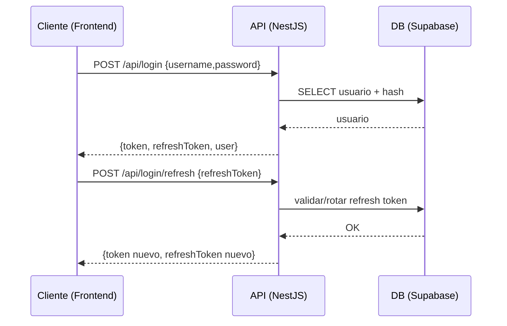

# Diagramas — Smart Economato

## 1) Contexto (C4 — Nivel 1)

```mermaid
flowchart LR
  U[Usuarios (web)] -->|HTTPS| FE[Frontend React]
  FE -->|/api| BE[Backend NestJS]
  BE -->|SQL (SSL)| DB[(Supabase Postgres)]
  BE -->|SMTP / log| MAIL[Servicio de correo]
```

## 2) Contenedores (C4 — Nivel 2)

```mermaid
flowchart TB
  subgraph Docker["Docker / entorno"]
    FE[Frontend (Vite/nginx)]
    BE[API (NestJS)]
  end
  DB[(Supabase Postgres - remoto)]

  FE -->|Proxy /api| BE
  BE -->|SSL| DB
```

## 3) Secuencia (login → refresh)



